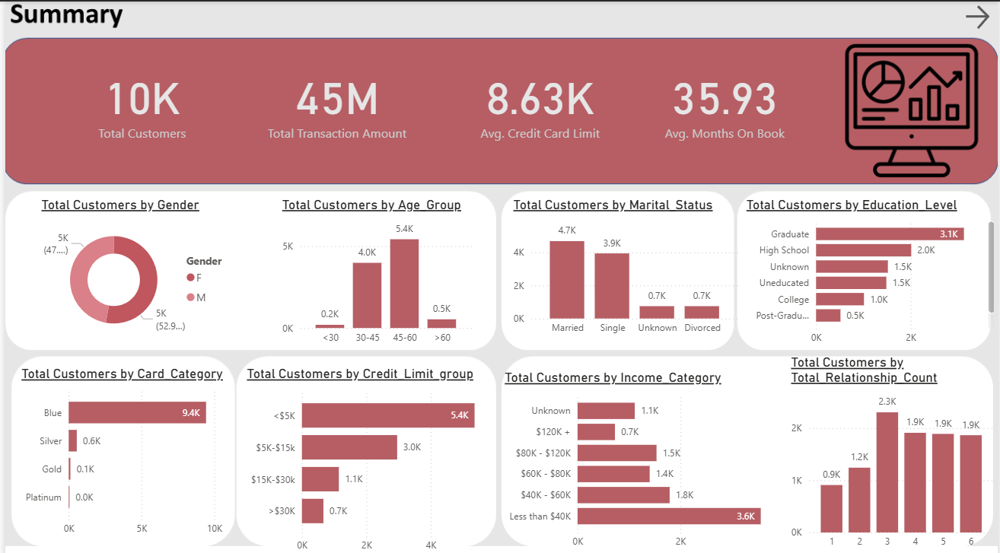
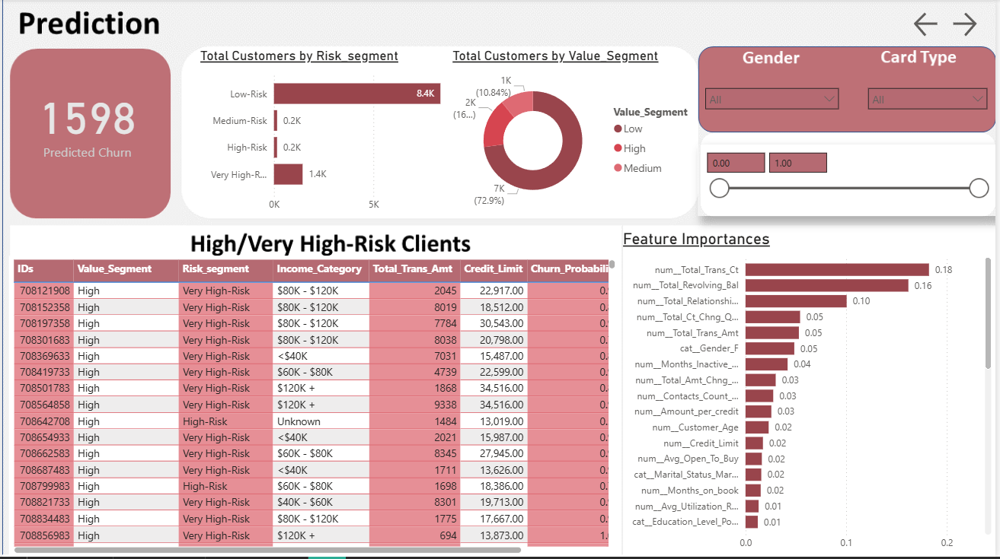
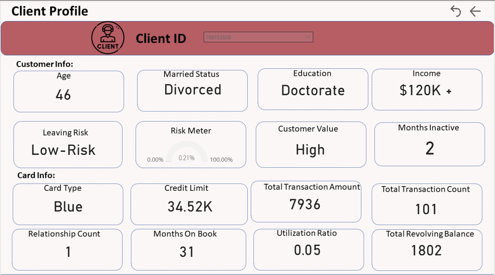

# 📊 Credit Card Customer Attrition Prediction

This project focuses on **analyzing and predicting customer attrition (churn)** in the banking sector using **machine learning and data science techniques**.  
The goal is to explore customer behavior, engineer meaningful features, train predictive models, and evaluate their performance to **identify factors that influence churn and assess customer risk**.

---

## 🚀 Project Workflow

### 1. Exploratory Data Analysis (EDA)
- Cleaned and preprocessed the raw dataset (`CreditCard.csv`).  
- Handled missing values and outliers.  
- Explored customer demographics, transaction behavior, and product usage using visualizations.  

### 2. Feature Engineering & Modeling
- Created meaningful features from demographic and transaction data.  
- Trained multiple models:  
  - Logistic Regression  
  - Random Forest  
  - XGBoost  
- Performed **hyperparameter tuning** to optimize model performance.  
- Evaluated models using **F1-Score & Recall** (prioritizing recall to capture more potential churners).  
- Selected the **best model** and extracted **feature importance** for actionable insights.  

### 3. Customer Segmentation
- Applied **KMeans clustering** on transaction behavior (`Credit_Limit`, `Total_Trans_Amt`, `Total_Trans_Ct`, `Avg_Utilization_Ratio`).  
- Segmented customers into **High-Value, Medium-Value, and Low-Value** groups for targeted interventions.  

### 4. Prediction + Risk Scoring
- After choosing the best model, predicted **churn probabilities for all customers** using the **whole dataset** to observe model behavior on all data.
- Classified customers into **Low-Risk, Medium-Risk, High-Risk, and Very High-Risk** based on probability bins.  
- Segmented customers into **High-Value, Medium-Value, and Low-Value** groups separately to analyze patterns across customer segments.

### 5. Business Dashboard (Power BI)
Designed an **interactive dashboard** with 3 pages:  

#### 📌 Page 1: Customer Summary
- KPIs: Total Customers, Attrition Rate, Avg. Credit Limit, Avg. Months on Book.  
- Breakdown by **Gender, Age, Marital Status, Education, Card Category, Income Group, Relationship Count**.  

#### 📌 Page 2: Prediction & Risk
- KPI cards for **Predicted Attrition**.  
- Distribution of customers across **Low / Medium / High / Very High Risk**.
- Table of **High-Risk customers** with demographic & value details.  
- Feature importance visualization showing top drivers of attrition.  

#### 📌 Page 3: Customer Profile & Value
- Segmentation of customers into **High, Medium, Low Value**.  
- Cross-filter with churn risk to prioritize interventions.  
- Customer profiling by demographics + product usage.  

---

## 🔎 Some Insights 
- Most **predicted churners are female**.  
- Majority of churners hold **Blue cards**.  
- Customers with **lower credit limits** are more likely to churn.  
- Customers who use their cards frequently are **less likely to churn**.  
- Higher-spending customers tend to be **more loyal**.  
- Feature importance analysis shows **transaction activity, relationship count, and utilization ratio** as key drivers of churn.  

---

## 📂 Project Structure

Credit Card Churn/
│
├── datasets/                          
│   ├── raw/                     
│   │   └── CreditCard.csv
│   ├── processed/                     
│   │   └── CreditCard_cleaned.csv
│   ├── prediction/              
│   │   └── Prediction.csv
│   └── Feature_Importance.csv
│
├── notebooks/                         
│   ├── EDA_and_Cleaning.ipynb         
│   └── Modelling_and_Prediction.ipynb 
│
├── models/                            
│   ├── best_model.pkl                  
│   └── preprocess_pipeline.pkl         
│
├── dashboard/                          
│   ├── CreditCardDashboard.pbix
│   └── pics/                     
│       ├── summary.png
│       ├── prediction.png
│       └── profile.png
│
├── figures/                            
│
└── README.md                            
